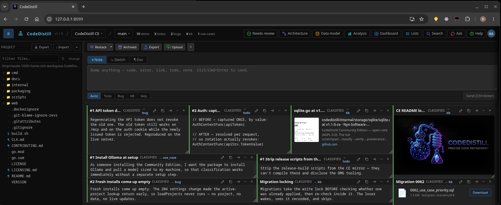

# CodeDistill — Community Edition

**Capture anything. Get back classified, traceable work — without your code or notes
leaving the machine.**

## Why

Every developer keeps notes on their projects — scratch files, a doc folder, a running
list of "things to fix." The trouble is they live *beside* the code instead of *in* it,
so they drift out of sync and lose their relevance.

As more software gets written **through LLMs**, that gap turns expensive. The *intent*
behind a change — why it was made, what it was meant to satisfy — is exactly what a
model (and the next human) needs, and exactly what evaporates into a side file.

CodeDistill closes it: you capture intent, an agent turns it into code, and the two are
distilled together into something that stays **verified and traceable** instead of
drifting apart.

## What you get

- **Paste anything onto a canvas** — stack traces, ideas, links, images, files, code,
  half-finished thoughts.
- **Automatic classification** into todos, bugs, knowledge-base entries and use cases,
  each anchored to the project it belongs to.
- **Acceptance criteria** — the checkable contract a piece of work is measured against.
  AI drafts a starting set; you ratify.
- **A code scan** that runs your installed analyzers and shows the findings, which you
  can push straight onto a scratchpad as work.
- **Code anchors** — tie a work item to the exact file and lines that implement
  it, so intent and code stay attached. Drop a file on an item, or set a range
  by hand.
- **Dashboards, code metrics, an architecture view and a data model view.**
- **MCP reads**, so Claude Code, Cursor or your own agent can see your work items.
- **Local and private.** Classification runs against your own
  [Ollama](https://ollama.com); storage is a single SQLite file. Nothing leaves the
  machine.

## Quick start

Linux or macOS, and Go 1.25+. On Windows use WSL — the scripts need bash. (Node
20+ only if you change the UI.)

    ./build.sh             # builds ./codedistill
    ./scripts/install.sh   # Ollama + models + database
    ./codedistill serve    # UI on http://localhost:8080

The middle step is the one that saves you the setup: it finds or installs
[Ollama](https://ollama.com), pulls the two models CodeDistill runs on —
`qwen2.5:7b` to classify and `nomic-embed-text` to embed, about 5 GB together —
and creates the database. It's idempotent, so re-run it if a step fails.

Already have Ollama with both models pulled? Skip it and go straight to `serve`.

## License

GNU Affero General Public License v3.0 — see [LICENSE](LICENSE). The commercial edition
is licensed separately and is not covered by this repository's license.

## Contributing

See [CONTRIBUTING.md](CONTRIBUTING.md) — contributions require a CLA.

---

## Beyond the Community Edition

The CE is the whole capture → classify → verify loop, free and self-hosted. The
commercial editions add the parts that turn it into a system of record for
AI-assisted work.

| | Community | Pro | Enterprise |
|---|:---:|:---:|:---:|
| Canvas, classification, acceptance criteria, dashboards | ● | ● | ● |
| Code scan (your installed analyzers) | ● | ● | ● |
| MCP reads | ● | ● | ● |
| Code anchors — tie a work item to the lines that implement it | ● | ● | ● |
| **MCP write tools** — agents create and complete work, recording where | | ● | ● |
| **Automatic anchoring** — anchors proposed for you, plus code search | | ● | ● |
| **Duplicate intelligence** | | ● | ● |
| **List / Calendar / Kanban views** | | ● | ● |
| **Multi-user workspaces** (OIDC, Postgres, seats) | | | ● |
| **S3 blob storage** | | | ● |
| **SARIF ingest + auto-route** from your CI and security tools | | | ● |
| **Governance gate** — block completion on a high-severity finding | | | ● |

Pro is $75/seat/year, node-locked and offline-verifiable. See
[codedistill.dev](https://codedistill.dev).
